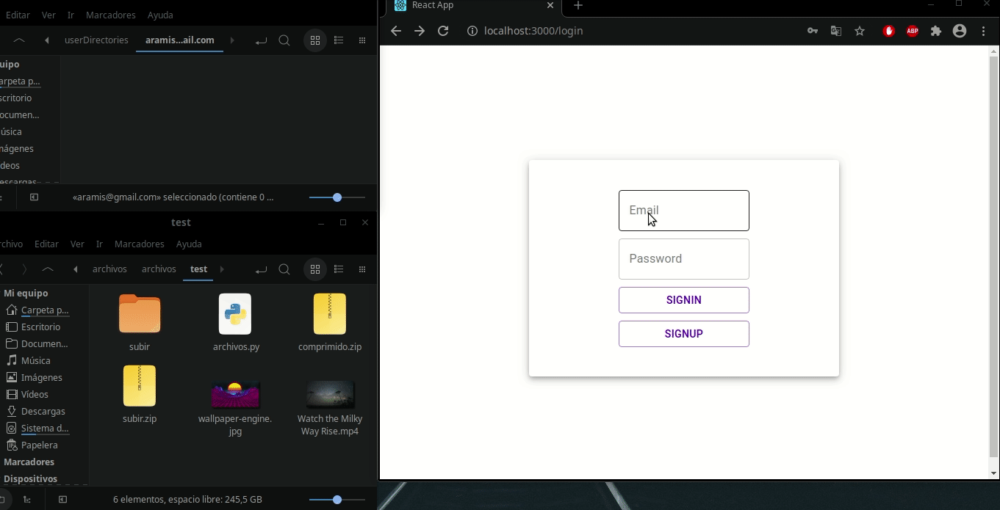
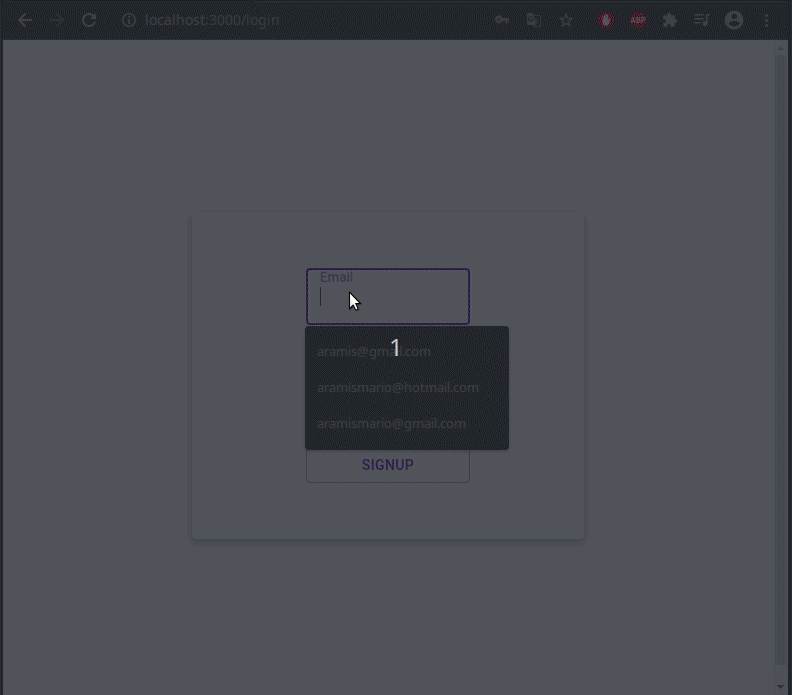

# fileUploader

This little project allows registration, login, upload, drag and drop, donwload and display some types of files.
When a user registers, a directory for the user to save his files is created.

Built using Django REST Framework and React.

## login and upload

## display and download

